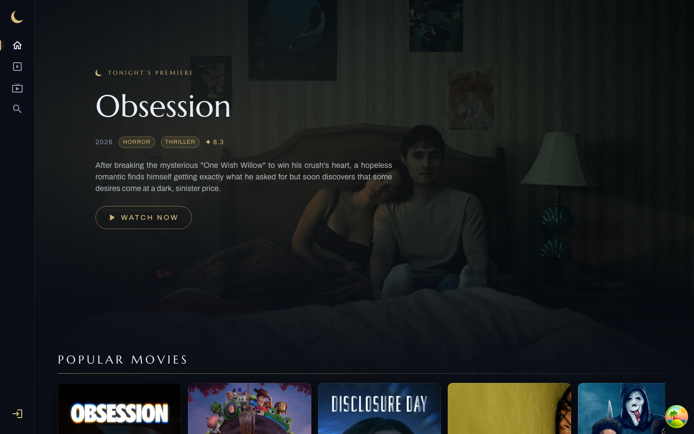
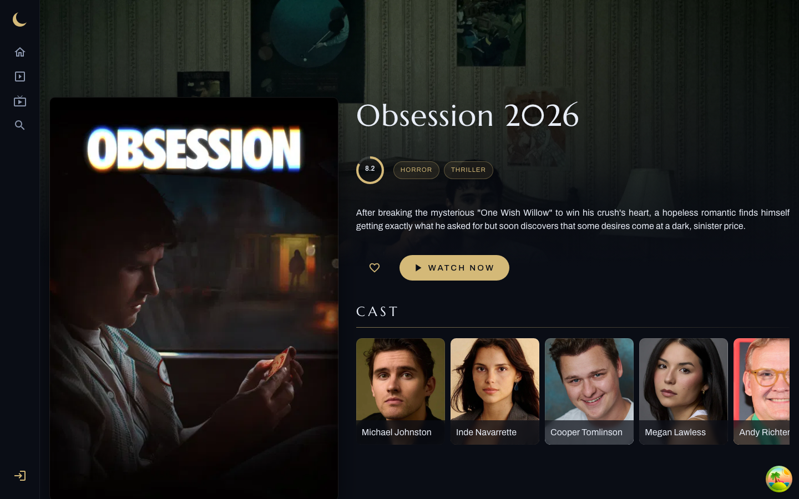
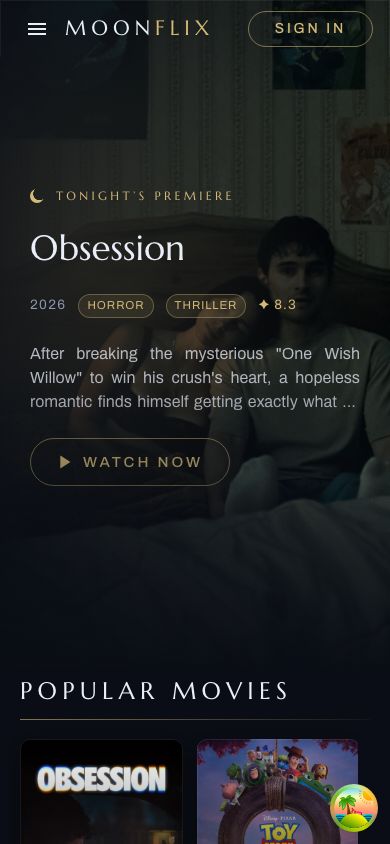

# MoonFlix 🌙

A full-stack movie & TV discovery app with a nocturnal identity of its own. Browse what's popular, dig into details, cast and trailers, keep favorites, and write reviews — all wrapped in **Selene**, a lunar-noir design: champagne gold on ink-blue night, engraved serif display type, and a Netflix-TV-style rail layout.



## Features

- **Immersive home** — full-bleed backdrop hero carousel that dissolves into the night background, with the first poster row riding over it
- **Browse & search** — popular / top-rated movies and series with infinite "load more", debounced search across movies, TV, and people with inline skeletons and empty states
- **Detail pages** — cast, trailers, backdrops, posters, recommendations, and user reviews per title; person pages with filmographies
- **Accounts** — sign up / sign in (JWT), favorites with gold-glow cards, personal review history, password update
- **Considered chrome** — icon nav rail on desktop, translucent top bar + drawer on mobile, gold "NEW" ribbons on releases under 30 days, per-route document titles

| Detail page | Mobile |
| --- | --- |
|  |  |

## Tech stack

**Client** (`client/`) — React 19 · TypeScript · Vite 5 · MUI v6 (Emotion) · TanStack React Query v5 (persisted cache) · Zustand · React Router 7 · Swiper · Formik + Yup · Vitest

**Server** (`server/`) — Node (ES modules) · Express 4 · MongoDB / Mongoose · JWT auth · TMDB API proxy · Helmet, CORS, rate limiting · Vitest

The server is the only thing that talks to TMDB; the client consumes `/api/v1/*` and gets augmented responses (e.g. `isFavorite`).

## Getting started

Prerequisites: **Node 20+**, **pnpm**, a running **MongoDB**, and a [TMDB API key](https://www.themoviedb.org/settings/api).

```bash
git clone git@github.com:Olbioss/MoonFlix.git && cd MoonFlix

# server
cd server
cp .env.example .env        # fill in MONGODB_URL, TOKEN_SECRET, TMDB_KEY
pnpm install
pnpm dev                    # http://127.0.0.1:5001 (node --watch)

# client (new terminal)
cd client
cp .env.example .env        # defaults point at the local server
pnpm install
pnpm dev                    # http://localhost:5173
```

> Port 5001 is the default because macOS AirPlay Receiver squats on 5000.

### Environment

| File | Keys |
| --- | --- |
| `server/.env` | `PORT`, `MONGODB_URL`, `TOKEN_SECRET`, `TMDB_BASE_URL`, `TMDB_KEY`, `CORS_ORIGINS` |
| `client/.env` | `VITE_API_BASE_URL`, `VITE_TMDB_IMAGE_BASE_URL` |

### Scripts

| Where | Command | What |
| --- | --- | --- |
| `client/` | `pnpm dev` / `pnpm build` / `pnpm preview` | Vite dev server / type-check + build / serve the build |
| `client/` | `pnpm exec vitest run` / `pnpm lint` / `pnpm format` | tests / ESLint / Prettier |
| `server/` | `pnpm dev` / `pnpm start` / `pnpm test` | API with watch reload / production start / tests |

## Design — "Selene"

A single committed dark theme (no mode toggle):

| Token | Value |
| --- | --- |
| Night ink (background) | `#0A0D15` |
| Surface | `#131A29` |
| Moon silver (text) | `#E9EEF8` |
| Muted blue-grey | `#8C97AE` |
| Champagne gold (accent) | `#D4B978` — dark text on gold |

Type is **Marcellus** (display, weight 400 only) over **Archivo** (body/UI), both self-hosted via Fontsource. Motifs: gold hairline rules, pill buttons with letterspaced caps, ✦ glyph ratings, slim gold scrollbars, slow `.35s` transitions. The theme lives in `client/src/configs/theme.configs.ts`; shared style helpers in `client/src/configs/ui.configs.ts`.

## Project layout

```
client/src/
  api/          axios clients, endpoint modules, React Query hooks + keys
  components/   MainLayout, NavRail, Topbar, Sidebar + common/ UI pieces
  configs/      theme, ui helpers, menu items
  pages/        Home, MediaList, MediaDetail, Search, Person, Favorites, Reviews
  store/        Zustand (UI state)
server/src/
  routes/ controllers/ models/ middlewares/ handlers/
```
